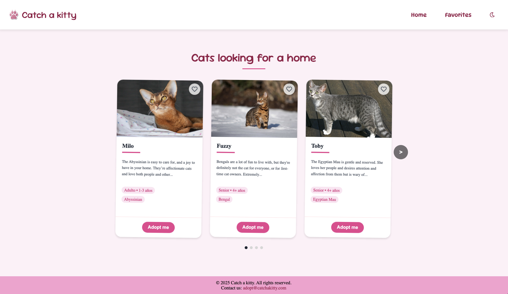
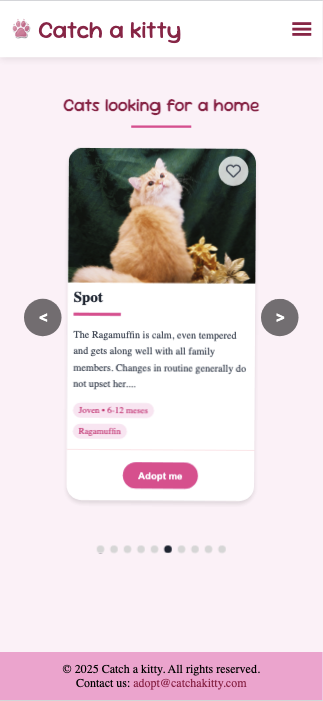

# 🐱 Atrapa un Michi

<div align="center">
  
  <h3>Find your purr-fect feline companion</h3>
</div>

## 📋 Overview

**Atrapa un Michi** is a responsive web application designed to connect cats with their forever homes. The platform showcases adoptable cats in an interactive, user-friendly interface allowing potential adopters to browse, save favorites, and begin the adoption process.

## ✨ Features

- **Interactive Cat Gallery**: Browse available cats in a responsive carousel (3 cats on desktop, 1 on mobile/tablet)
- **Detailed Cat Profiles**: Each cat has a profile with image, name, age, breed, and description
- **Favorites System**: Save cats to your favorites list for later review
- **Responsive Design**: Optimized experience across desktop, tablet, and mobile devices
- **Theme Support**: Toggle between light and dark mode for comfortable viewing
- **Adoption Process**: Simple workflow to start the adoption process for your chosen cat

## 🖥️ 



## 🛠️ Technologies

### Frontend

- **React**: Component-based UI development
- **React Router**: Navigation and routing
- **React Hook Form**: Form management and validation
- **React Icons**: UI icons
- **CSS**: Custom styling with responsive design

### State Management

- **Context API**: Global state management for favorites and theme
- **localStorage**: Persistence for user preferences and favorites

### API Integration

- **The Cat API**: Source of cat data and images

### Development & Testing

- **Vite**: Fast development environment and build tool
- **Vitest**: Unit and component testing
- **ESLint**: Code quality and consistency

## 🚀 Getting Started

### Prerequisites

- Node.js (v16 or higher)
- npm or yarn

### Environment Variables

Create a `.env` file in the root directory with the following variables:

```
VITE_API_KEY=your_cat_api_key
```

You can obtain an API key from [The Cat API](https://thecatapi.com/).

### Installation

1. Clone the repository:

   ```bash
   git clone https://github.com/mariaprez32/atrapa-un-michi.git
   cd atrapa-un-michi
   ```

2. Install dependencies:

   ```bash
   npm install
   # or
   yarn install
   ```

3. Start the development server:

   ```bash
   npm run dev
   # or
   yarn dev
   ```

4. Open your browser and visit `http://localhost:5173`

## 🧪 Running Tests

```bash
# Run tests
npm run test

# Run tests in watch mode
npm run test:watch
```

## 📱 Usage

1. **Browse Cats**: Explore available cats in the carousel on the home page
2. **Save Favorites**: Click the heart icon on a cat's card to add it to your favorites
3. **View Favorites**: Navigate to the "Favorites" page to see all your saved cats
4. **Start Adoption**: Click the "Adopt me" button to begin the adoption process for a specific cat
5. **Toggle Theme**: Switch between light and dark mode using the theme toggle in the header

## 📁 Project Structure

```
atrapa-un-michi/
├── public/               # Static assets
│   ├── paw-logo.png      # App logo
│   └── ...
├── src/
│   ├── components/       # Reusable UI components
│   │   ├── Button/       # Button component
│   │   ├── CatCard/      # Cat card component
│   │   ├── CatsSlider/   # Carousel component
│   │   ├── FavoriteButton/ # Favorite button component
│   │   ├── Footer/       # Footer component
│   │   └── Header/       # Header with navigation
│   ├── contexts/         # React contexts
│   │   ├── FavoriteContext/ # Favorites state management
│   │   └── ThemeContext/ # Theme state management
│   ├── hooks/            # Custom React hooks
│   │   └── useFavorites.js # Hook for favorites functionality
│   ├── pages/            # Application pages
│   │   ├── AdoptPage/    # Adoption form page
│   │   ├── FavoritesPage/ # Saved favorites page
│   │   └── HomePage/     # Main landing page
│   ├── routes/           # Routing configuration
│   │   └── AppRoutes.jsx # App routes definition
│   ├── services/         # API services
│   │   └── catService.js # Cat API integration
│   ├── App.jsx           # Main App component
│   ├── App.css           # Global styles
│   └── main.jsx          # Entry point
├── .env                  # Environment variables
├── package.json          # Dependencies and scripts
├── vite.config.js        # Vite configuration
└── README.md             # Project documentation
```

## 📱 Responsive Design



The application is fully responsive with different layouts for:

- **Desktop (>900px)**: 3-column carousel, full navigation
- **Tablet (768px-900px)**: 1-column carousel, hamburger menu
- **Mobile (<768px)**: 1-column carousel, optimized spacing, hamburger menu

## 🔄 Continuous Improvement

Upcoming features and improvements:

- User authentication and profiles
- Filter and search functionality
- Adoption status tracking
- Integration with more cat rescue APIs
- Progressive Web App (PWA) capabilities

## 👥 Contributing

Contributions are welcome! To contribute:

1. Fork the repository
2. Create a feature branch (`git checkout -b feature/amazing-feature`)
3. Commit your changes (`git commit -m 'Add some amazing feature'`)
4. Push to the branch (`git push origin feature/amazing-feature`)
5. Open a Pull Request

Please ensure your code follows the project's style guidelines and includes appropriate tests.


## 🙏 Acknowledgements

- [The Cat API](https://thecatapi.com/) for providing cat data
- [React Icons](https://react-icons.github.io/react-icons/) for the icon set
- All the contributors and reviewers who have helped improve this project

---

<div align="center">
  <p>Made with ❤️ by <a href="https://github.com/mariaprez32">María Pérez</a>, <a href="https://github.com/aelnor-dev">Lorena Martínez </a> y <a href="https://github.com/yuliia-martynovych">Yuliia Martynovych</a> </p></p>
  <p>🐾 Help a cat find their forever home 🐾</p>
</div>
